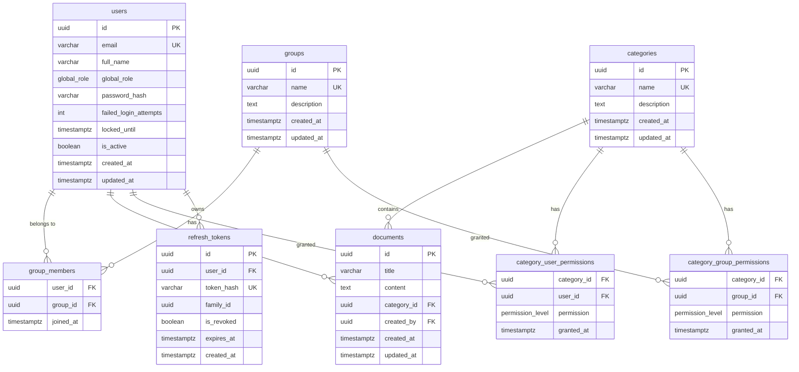

# Data Model

**Agent:** `@data-modeler`
**Project:** System Management
**Date:** 2026-04-25
**Input:** requirements.md, architecture.md

---

## Entity Relationship Diagram



---

## PostgreSQL DDL

### Enums

```sql
CREATE TYPE global_role AS ENUM ('ADMIN', 'EDITOR', 'VIEWER');
CREATE TYPE permission_level AS ENUM ('READ', 'WRITE', 'EDIT');
```

### Tables

```sql
CREATE TABLE users (
    id                      UUID PRIMARY KEY DEFAULT gen_random_uuid(),
    email                   VARCHAR(255) NOT NULL UNIQUE,
    full_name               VARCHAR(100) NOT NULL,
    global_role             global_role NOT NULL DEFAULT 'VIEWER',
    password_hash           VARCHAR(255) NOT NULL,
    failed_login_attempts   INT NOT NULL DEFAULT 0,
    locked_until            TIMESTAMPTZ,
    is_active               BOOLEAN NOT NULL DEFAULT TRUE,
    created_at              TIMESTAMPTZ NOT NULL DEFAULT NOW(),
    updated_at              TIMESTAMPTZ NOT NULL DEFAULT NOW()
);

CREATE TABLE groups (
    id          UUID PRIMARY KEY DEFAULT gen_random_uuid(),
    name        VARCHAR(100) NOT NULL UNIQUE,
    description TEXT,
    created_at  TIMESTAMPTZ NOT NULL DEFAULT NOW(),
    updated_at  TIMESTAMPTZ NOT NULL DEFAULT NOW()
);

CREATE TABLE group_members (
    user_id     UUID NOT NULL REFERENCES users(id) ON DELETE CASCADE,
    group_id    UUID NOT NULL REFERENCES groups(id) ON DELETE CASCADE,
    joined_at   TIMESTAMPTZ NOT NULL DEFAULT NOW(),
    PRIMARY KEY (user_id, group_id)
);

CREATE TABLE categories (
    id          UUID PRIMARY KEY DEFAULT gen_random_uuid(),
    name        VARCHAR(100) NOT NULL UNIQUE,
    description TEXT,
    created_at  TIMESTAMPTZ NOT NULL DEFAULT NOW(),
    updated_at  TIMESTAMPTZ NOT NULL DEFAULT NOW()
);

CREATE TABLE documents (
    id          UUID PRIMARY KEY DEFAULT gen_random_uuid(),
    title       VARCHAR(255) NOT NULL,
    content     TEXT NOT NULL DEFAULT '',
    category_id UUID NOT NULL REFERENCES categories(id) ON DELETE CASCADE,
    created_by  UUID NOT NULL REFERENCES users(id),
    created_at  TIMESTAMPTZ NOT NULL DEFAULT NOW(),
    updated_at  TIMESTAMPTZ NOT NULL DEFAULT NOW()
);

CREATE TABLE category_user_permissions (
    category_id UUID NOT NULL REFERENCES categories(id) ON DELETE CASCADE,
    user_id     UUID NOT NULL REFERENCES users(id) ON DELETE CASCADE,
    permission  permission_level NOT NULL,
    granted_at  TIMESTAMPTZ NOT NULL DEFAULT NOW(),
    PRIMARY KEY (category_id, user_id)
);

CREATE TABLE category_group_permissions (
    category_id UUID NOT NULL REFERENCES categories(id) ON DELETE CASCADE,
    group_id    UUID NOT NULL REFERENCES groups(id) ON DELETE CASCADE,
    permission  permission_level NOT NULL,
    granted_at  TIMESTAMPTZ NOT NULL DEFAULT NOW(),
    PRIMARY KEY (category_id, group_id)
);

CREATE TABLE refresh_tokens (
    id          UUID PRIMARY KEY DEFAULT gen_random_uuid(),
    user_id     UUID NOT NULL REFERENCES users(id) ON DELETE CASCADE,
    token_hash  VARCHAR(64) NOT NULL UNIQUE,
    family_id   UUID NOT NULL,
    is_revoked  BOOLEAN NOT NULL DEFAULT FALSE,
    expires_at  TIMESTAMPTZ NOT NULL,
    created_at  TIMESTAMPTZ NOT NULL DEFAULT NOW()
);
```

---

## Index Plan

```sql
-- users: email lookup on login
CREATE UNIQUE INDEX idx_users_email ON users(email);

-- users: search by name/email
CREATE INDEX idx_users_full_name ON users(full_name);

-- group_members: find all groups for a user (permission resolution)
CREATE INDEX idx_group_members_user_id ON group_members(user_id);

-- group_members: find all members of a group
CREATE INDEX idx_group_members_group_id ON group_members(group_id);

-- documents: list documents in a category (paginated)
CREATE INDEX idx_documents_category_id ON documents(category_id);

-- category_user_permissions: permission lookup by user
CREATE INDEX idx_cup_user_id ON category_user_permissions(user_id);

-- category_group_permissions: permission lookup by group
CREATE INDEX idx_cgp_group_id ON category_group_permissions(group_id);

-- refresh_tokens: token lookup on refresh (most frequent)
CREATE UNIQUE INDEX idx_refresh_tokens_hash ON refresh_tokens(token_hash);

-- refresh_tokens: active tokens per user (revoke all on deactivation)
CREATE INDEX idx_refresh_tokens_user_active
    ON refresh_tokens(user_id)
    WHERE is_revoked = FALSE;

-- refresh_tokens: family revocation on reuse detection
CREATE INDEX idx_refresh_tokens_family_id ON refresh_tokens(family_id);
```

---

## Flyway Migration Plan

| Version | Description |
|---------|-------------|
| V1 | Create `global_role` and `permission_level` PostgreSQL enums |
| V2 | Create `users` table |
| V3 | Create `groups` and `group_members` tables |
| V4 | Create `categories` table |
| V5 | Create `documents` table |
| V6 | Create `category_user_permissions` and `category_group_permissions` tables |
| V7 | Create `refresh_tokens` table + all indexes |
| V8 | Seed default ADMIN user for development |

---

## Permission Resolution Query

```sql
-- Resolve effective permission for a user on a category
-- Used by PermissionService.resolvePermission()

WITH user_role AS (
    SELECT global_role FROM users WHERE id = :userId
),
group_perms AS (
    SELECT MAX(cgp.permission::text) as max_perm
    FROM group_members gm
    JOIN category_group_permissions cgp
        ON cgp.group_id = gm.group_id
    WHERE gm.user_id = :userId
      AND cgp.category_id = :categoryId
),
direct_perm AS (
    SELECT permission
    FROM category_user_permissions
    WHERE category_id = :categoryId AND user_id = :userId
)
SELECT
    ur.global_role,
    gp.max_perm   AS group_permission,
    dp.permission AS direct_permission
FROM user_role ur
LEFT JOIN group_perms gp ON TRUE
LEFT JOIN direct_perm dp ON TRUE;
```

---

## Design Notes

| Decision | Rationale |
|----------|-----------|
| UUID primary keys | Distributed-safe, non-enumerable, no sequential IDOR |
| `ON DELETE CASCADE` on documents → category | Category delete removes all documents atomically |
| `ON DELETE CASCADE` on permissions → category/user/group | No orphan permissions possible |
| Composite PK on `group_members` | Prevents duplicate membership without extra unique index |
| Composite PK on permission tables | One permission entry per (category, user/group) pair |
| `token_hash VARCHAR(64)` | SHA-256 hex output is always 64 chars |
| `family_id UUID` on refresh_tokens | Enables full family revocation on reuse detection |
| Partial index on active refresh tokens | Fast lookup for revocation without scanning revoked tokens |
